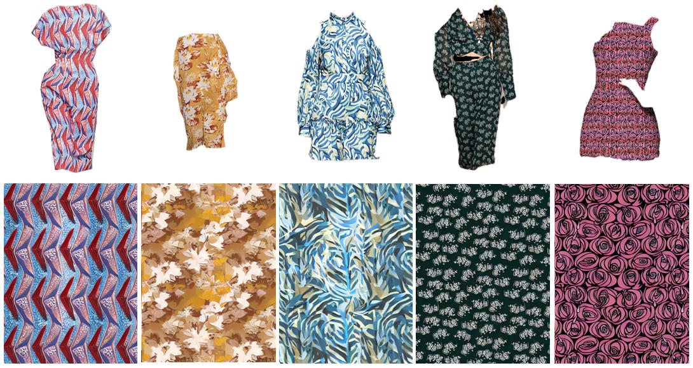

# 👕 SLDDM-TPG: Semi-supervised Latent Disentangled Diffusion Model for Textile Pattern Generation


> **Official Implementation of the paper:** "Semi-supervised Latent Disentangled Diffusion Model for Textile Pattern Generation"

## 📖 Overview

Our method targets high-quality textile **pattern generation from clothing images (TPG)**. We propose a semi-supervised framework consisting of two main stages:
1. **LDN (Latent Disentangled Network):** Extracts disentangled representation features.
2. **S-LDM (Semi-supervised Latent Diffusion Model):** Generates high-fidelity pattern images guided by the extracted features.

### Generation Results
| Framework | Generation Results |
| :---: | :---: |
|  |  |

---

## 📁 Project Structure

```text
SLDDM-TPG/
├── configs/            # Config files for model training & inference (e.g., slddm512.yaml)
├── ldm/                # Core Latent Diffusion Model files, data loaders, and modules
├── ldn/                # Stage 1: Latent Disentangled Network source code
├── src/                # Third-party dependencies (taming-transformers, clip, etc.)
├── assets/             # Images for README
├── main.py             # Training script for Stage 2 (S-LDM)
├── test.py             # Inference script
├── test.sh             # Shell script for easy testing
└── environment.yaml    # Conda environment configuration
```

---

## 🛠️ Environment Setup

We recommend using Conda to set up the environment easily:

```bash
conda env create -f environment.yaml
conda activate slddm
```

---

## 🗄️ Dataset Preparation

### 1. Download
* **VITON-HD:** Publicly available [here](https://github.com/shadow2496/VITON-HD).
* **CTP-HD (Our Dataset):** Contains paired *clothing <-> textile pattern* images. You can see some cases in the `assets/cases` floder.

### 2. Directory Structure
Please organize the downloaded dataset following the hierarchical structure below. Ensure you have `train.txt` and `test.txt` containing the image filenames.

```text
<dataroot_path>/ (e.g., /home/dataset/CTP-HD/)
├── cloth/                 # Original clothing images (e.g., .jpg or .png)
├── cloth_mask/            # Corresponding clothing masks 
├── pattern/               # Target textile pattern images 
├── train.txt              # List of training image filenames (e.g., '0001.jpg')
└── test.txt               # List of testing image filenames
```

<div align="center">
  
</div>

---

## 📦 Pretrained Weights Preparation

Before training or inference, prepare the necessary pretrained weights. Stable Diffusion v1.5:** Download the SD v1.5 weights (e.g., `v1-5-pruned-emaonly.ckpt`) from [here](https://huggingface.co/stable-diffusion-v1-5/stable-diffusion-v1-5/tree/main). Recommended Weights Placement:
```text
SLDDM-TPG/
└── pretrained_models/
    ├── stable-diffusion-v1-5.ckpt       # For Stage 2 initialization
    └── ldn_stage1_best.pth.tar          # (After you train Stage 1)
```

---

## 🚀 Training

### Stage 1: Latent Disentangled Network (LDN)

Navigate to the `ldn/` directory or run the LDN training script. The `--accumulate_steps 8` simulates a larger batch size by accumulating gradients.

```bash
CUDA_VISIBLE_DEVICES=0,1 python ldn/main_sd.py \
  --dist-url 'tcp://localhost:12356' \
  --multiprocessing-distributed \
  --world-size 2 \
  --rank 0 \
  --scm-epochs 100 \
  --epochs 200 \
  --weight-decay 1e-3 \
  --learning-rate 1e-4 \
  --final-lr 1e-6 \
  --fix-pred-lr \
  --batch-size 32 \
  --accumulate_steps 8 \
  <path_to_your_dataset> # e.g., /dataset/CTP-HD
```

### Stage 2: Semi-supervised Latent Diffusion Model (S-LDM)

Adjust Lightning Trainer parameters inside `configs/slddm512.yaml` (e.g., GPUs to use). This script fully supports Distributed Data Parallel (DDP).

```bash
python -u main.py \
    --logdir logs/train_slddm \
    --pretrained_model pretrained_models/stable-diffusion-v1-5.ckpt \
    --base configs/slddm512.yaml \
    --scale_lr False
```

---

## 🎨 Inference
You can use our provided weights for [inference] (https://huggingface.co/hucegon/slddm-tpg/upload/main) (the model is still undergoing iterations, and any future updates will be released promptly). To generate patterns from test clothing images, run the `test.py` script. Alternatively, just run `bash test.sh`.

```bash
python test.py \
    --gpu_id 0 \
    --ddim_steps 50 \
    --outdir results/generated_patterns \
    --config configs/slddm512.yaml \
    --dataroot <path_to_your_test_dataset> \
    --ckpt <path_to_trained_slddm_checkpoint.ckpt> \
    --n_samples 4 \
    --seed 23 \
    --scale 7.5 \
    --H 512 \
    --W 512
```

> **Tips:** 
> - You can increase `<ddim_steps>` (e.g., to 100) for potentially better generation quality at the cost of inference speed.
> - You can adjust the `--scale` parameter to control the condition strength, preventing image overexposure or distortion caused by excessively strong guidance.