# **Semi-supervised Latent Disentangled Diffusion Model for Textile Pattern Generation**（SLDDM-TPG）

## **🕮 Title Description**

**Textile pattern generation**: A textile pattern image refers to the original design blueprint of the various patterns appearing on garments. Textile pattern generation (TPG) aims to recover this underlying textile pattern image solely from a naturally photographed clothing image.

**Disentangled**: Due to the non-rigid nature of clothing images, texture defects—such as *deformations*, *blurriness*, and *occlusions*—as well as artifacts introduced by natural photography, often lead to feature confusion (feature entanglement). Therefore, it is essential to disentangle the feature representations of clothing images.

**Semi-supervised**: We construct the CTP-HD dataset, which contains both labeled and unlabeled samples, where the labels correspond to ground-truth textile pattern images. To enable semi-supervised learning, we introduce novel modules and training strategies, such as alignment process, CLS module, STD loss and so on, that extend the original latent diffusion model.

## **🎞 Compared Cases**

<!-- 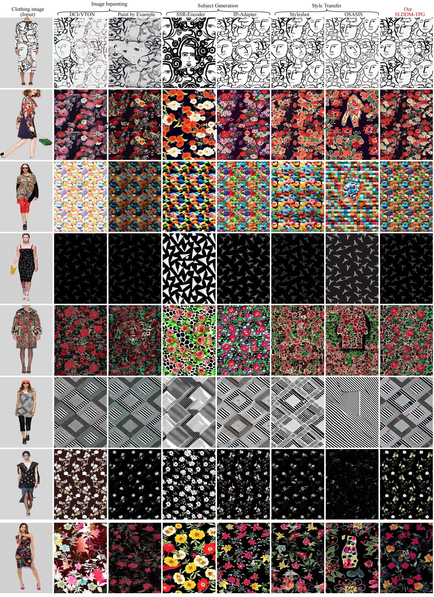 -->


## **🔧️ Framework**

<!-- 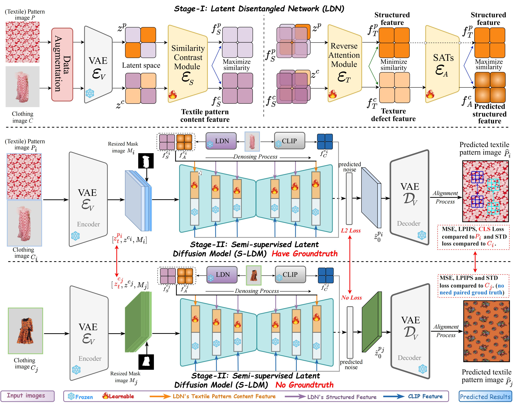 -->

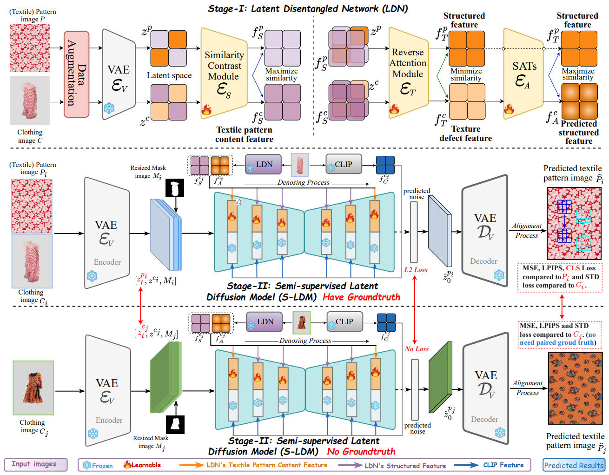
<div style="text-align: center;">
  (1) SLDDM-TPG Framework
</div>

<!-- 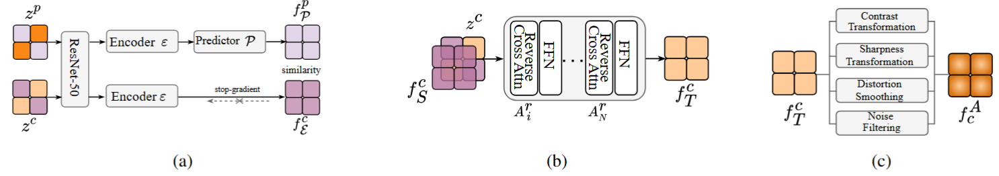 -->


<div style="text-align: center;">
  (2) The details of LDN. (a) SCM. (b) RAM.  (c) SATs.
</div>

<!-- 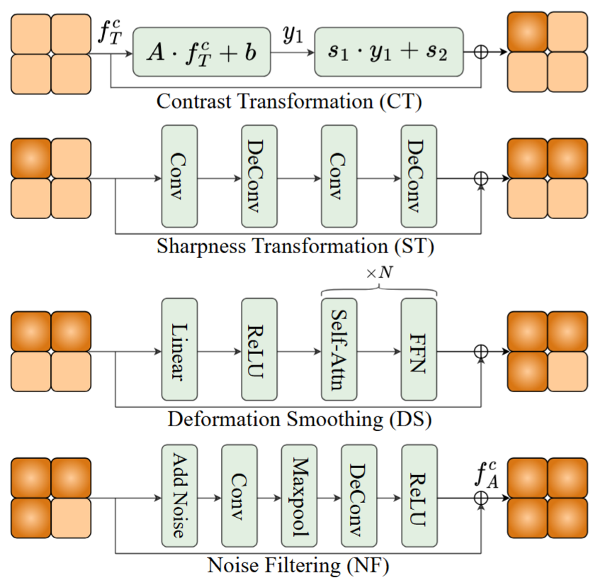 -->


<div style="text-align: center;">
  (3) The detailed network architecture of SATs.
</div>

<p></p>
<p></p>

**Explanation of the three features obtained by decoupling the LDN network**
1. **$f^c_S$ : textile pattern content feature in clothing image  $(C)$.**
*Note: textile pattern content feature indicates that $C$ and $P$ share common content features, such as pattern details, etc.*
2. **$f^c_T:$ texture defect feature in clothing image $(C)$.**
*Note: Due to the non-rigid nature of clothing images, texture defect feature represents the deformations, blurriness, and occlusions properties.*
3. **$f^c_A$: predicted structured feature $(C)$.**
*Note: We define the structured features in textile patterns as flatness, clarity, and full visibility.*

## **📥 Installation**

### **Create conda environment**

```python
conda env create -f environment.yaml
conda activate slddm
```

## **📜 Usage**

### **Download Pretrained Models**

We use stable-diffusion-v1-5 as our backbone and you can download the public weights.

We use SimSiam (original model: resnet18, is public) as our LDN's SCM model, and the remaining modules are trained from weight initialization.

### **Download the Dataset**

Our CTP-HD dataset will be made public soon.

VITON-HD data is publicly available and you can obtain and download it.

For the downloaded data, we recommend storing it in three hierarchical directories: *cloth, cloth_mask, and pattren*. cloth is the clothing image, cloth_mask is the mask image of the clothing image, and pattern is the textile pattern image corresponding to the clothing image. 

```python
data
|-- cloth
|   |-- A0000.png
|   |-- A0001.png
|   |-- A0002.png
|   |-- A0003.png
|   |-- ...
|-- cloth_mask
|   |-- A0000.png
|   |-- A0001.png
|   |-- A0002.png
|   |-- A0003.png
|   |-- ...
|-- pattern
|   |-- A0000.png
|   |-- A0001.png
|   |-- A0002.png
|   |-- A0003.png
|   |-- ...
```

For cloth_mask, you can use SCHP segmentation to get the corresponding clothing image segmentation result.  Somple samples of our CTP-HD dataset as follows:

<!-- 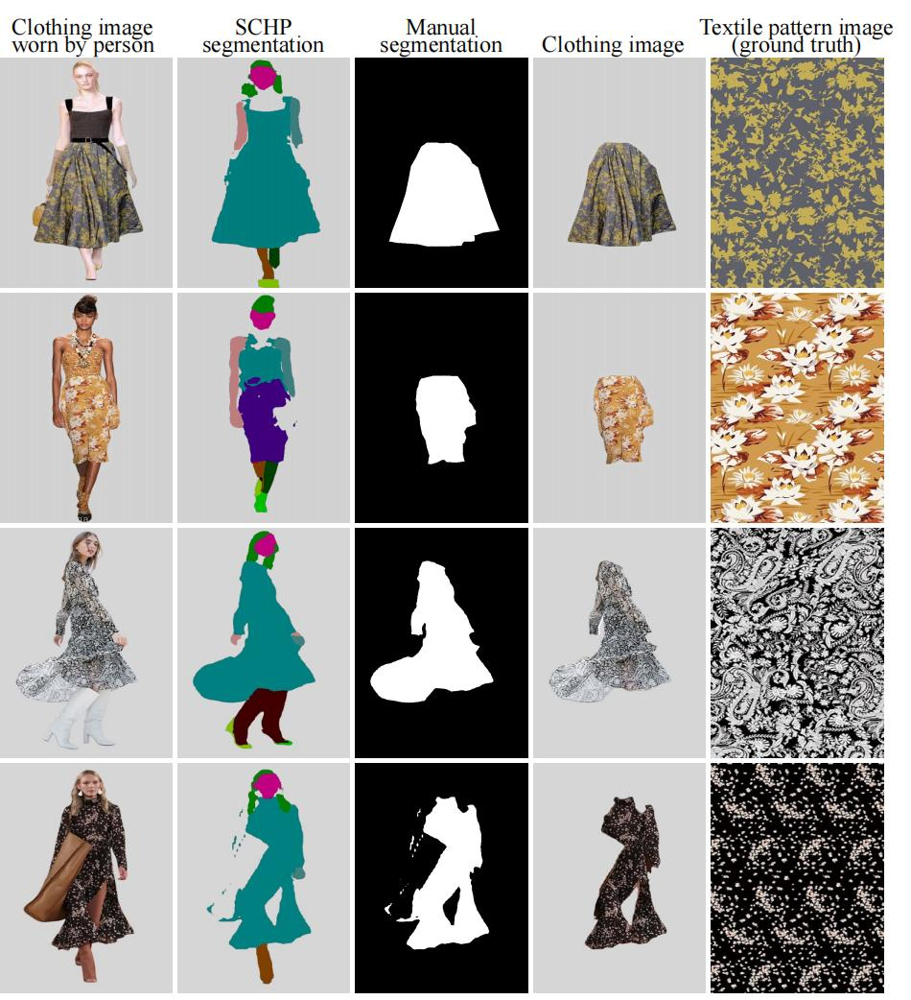 -->


### **Training for Stage1: LDN**

Our LDN network directory is in the `SLDDM-TPG/ldn` directory. You can train the LDN network by executing the following script. Here, `accumulate_steps` means accumulating 8 batches of gradients before back propagation to simulate the effect of large batch training.

```python
CUDA_VISIBLE_DEVICES=<set usable cuda index, such as 0,1> python main_sd.py \
  --dist-url 'tcp://localhost:12356' \
  --multiprocessing-distributed \
  --world-size 2 \
  --rank 0 \
  --resume <firstly train, please set to None>
  --scm-epochs 100 \
  --epochs 200 \
  --weight-decay 1e-3 \
  --learning-rate 1e-4 \
  --final-lr 1e-6 \
  --fix-pred-lr \
  --batch-size 16 \
  --accumulate_steps 8 \
  <add your dataroot_path, such as /home/name/ctp_hd_data>
```

First, we will train the Similarity Comparison Module (SCM) in the first 100 epochs. Then, the Reverse Attention Module (RAM) and Structured Affine Transformations (SATs) will be jointly trained in the last 100 epochs.

### **Training for Stage2: S-LDM**

You can set trainer-related parameters in `SLDDM-TPG/configs/slddm512.yaml`, modify `gpus` to indicate the GPU number you use, and the code supports distributed training. If your GPU space is sufficient, you can try to increase `batch_size` in the params parameter. Our setting is 2, and you can set it to 4 or 8. 

You can set the `image_size` for training in the data parameter. We set it to 512, preferably 256 or 128, which are powers of 2. You can set it to `dataroot`, which is the root directory where you download the data.  You can train the S-LDM by executing the following script: 

```python
python -u main.py \
	--logdir logs/train_106 \
	--pretrained_model <set the downloaded stable-diffusion-v1-5 path> \
	--base config/slddm512.yaml \
	--scale_lr False
```

Because a lot of configurations are written in config, the relevant properties here are just to configure some parameters that need to be changed during training.

During the training process, the model's saved parameters are saved in `logs/train_106`, including checkpoints, testtube (which stores some training data and can be visualized through tensorboard), and image (which is sampled every epoch during the training process to view the effect of the currently generated image).

### **Run Inference**

Inference can adjust the sampling steps of DDIM. It is also necessary to extract the mask of the clothing part of the clothing image to be tested. The pattern image is not needed. The subdirectories under the directory are cloth, cloth_mask. You can use the following script to perform inference:

```python
python test.py --gpu_id 0 \
--ddim_steps 100 \
--outdir <The directory where the generated results are stored> \
--config config/slddm512.yaml \
--dataroot <Directory of test clothing images and masks> \
--ckpt <Directory of ckpt obtained through training>
--n_samples 4 \
--seed 23 \
--scale 7.5 \
--H 512 \
--W 512 \
```

## More Experiments (Details in Our Appendix)

### User Study

Here, we conduct a user study to evaluate the quality of the images generated by our SLDDM-TPG and other baselines. All the models use the same seed during our user study. We selected 100 clothing images of different styles and content, and used these baseline models to generate corresponding textile pattern images. The order of the models is shuffled and the participants were not informed which images are generated by some certain model for a fair comparison. We asked 35 participants rated the similarity score between the generated image and the clothing image based on three evaluation criteria: (1) Overall visual similarity (40%); (2) Content object property details (40%); (3) Clarity (20%). For each question, the user is asked to give a score from $0$ to $5$, decimals are supported. Finally, we weight the three scores of each generated result of different models (the user does not know these weights when scoring), and use the highest score as the best generated result to calculate the final user support rate for every methods. As can be seen in Tab. \ref{tab:userstudy}, the user support rates of our SLDDM-TPG are higher than all competitors. At the same time, in order to avoid the user's inaccurate judgment caused by the selected clothing image not being clear enough, we use GPT-4o l to generate a detailed text for each image, which mainly includes a clear description of the content objects contained in each clothing image, as shown in Figure below. Users re-score \textit{(2) Content object property details} based on their own judgment and generated text description, especially the text marked in blue, and finally calculate the new user support rate. It can be found that our method also has a higher support rate, even higher than the original support rate, which shows that our method is more fine-grained and faithful in reconstructing content details. As shown in Figure below, in most cases, the result of our SLDDM-TPG is more faithful and accurate, achieving better content details in the blue part of the text prompt.

<!-- 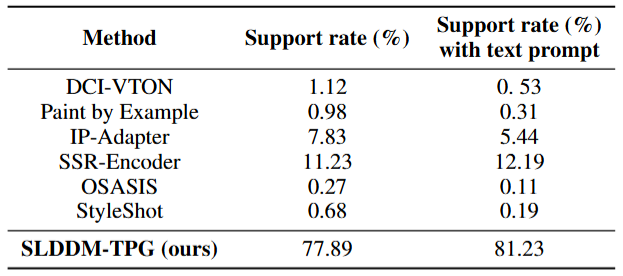 -->
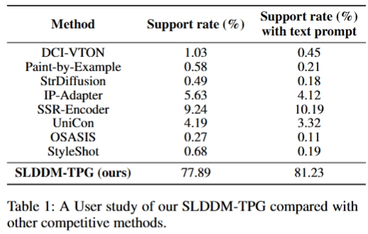

<!-- 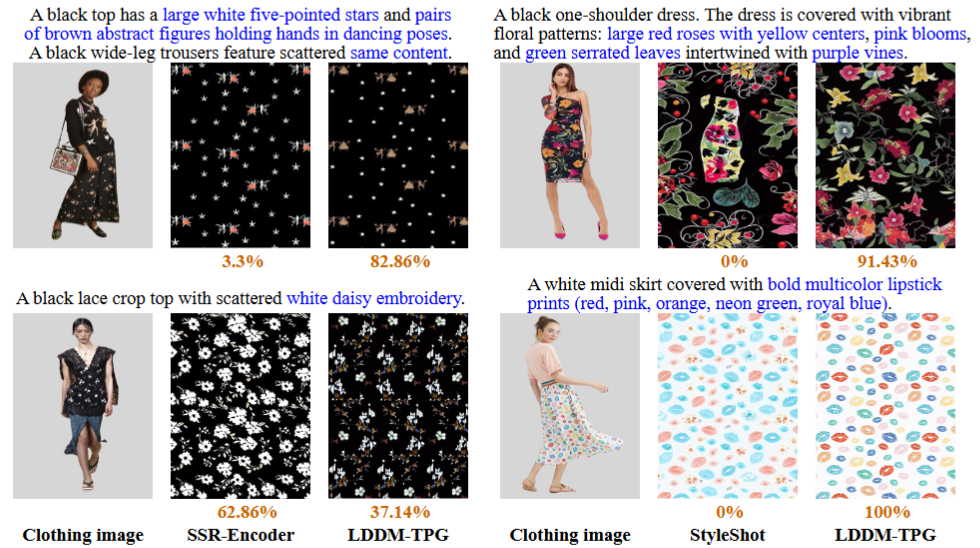 -->


### Model Efficiency

As shown in Tab. \ref{tab:efficiency}, we conduct an inference time and the number of trainable parameters comparison of seven models with our method in this section. We generate textile pattern images using the same 25 clothing images on an A6000 GPU, taking the average inference time and all models use the DDIM sampler with a sampling step of 50 for a fair comparison. Although our method neither achieves the fastest inference nor the minimal parameters, its performance substantially outperforms all competitors, establishing an optimal effectiveness-efficiency tradeoff.

<!-- 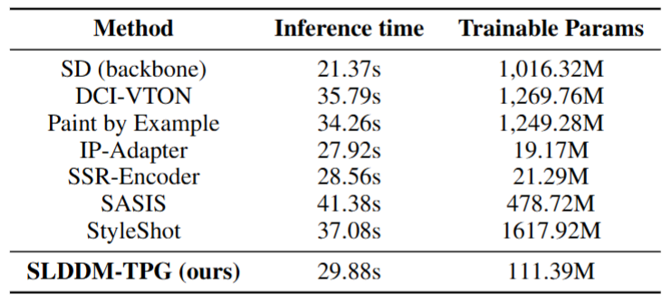 -->
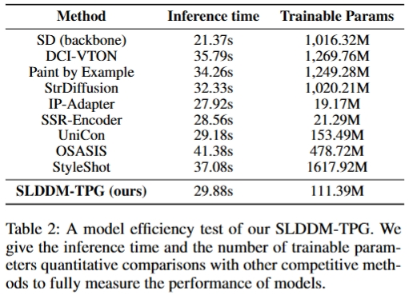

### Limitation and badcases

While our SLDDM-TPG outperforms other baselines and can generate faithful and high-quality pattern images based on clothing images, it still struggles with extracting accurate representations of complex content patterns from reference clothing images, especially the low-quality, small-area images, as shown in Figure below. This may be because there are not enough complex samples in our training data or because our model's disentangled ability does not perform well on complex samples. In future work, we plan to expand our labeled dataset and optimize the integration of disentangled features into the diffusion model for better fine-tuning to get more complex content generation from clothing images.

<!-- 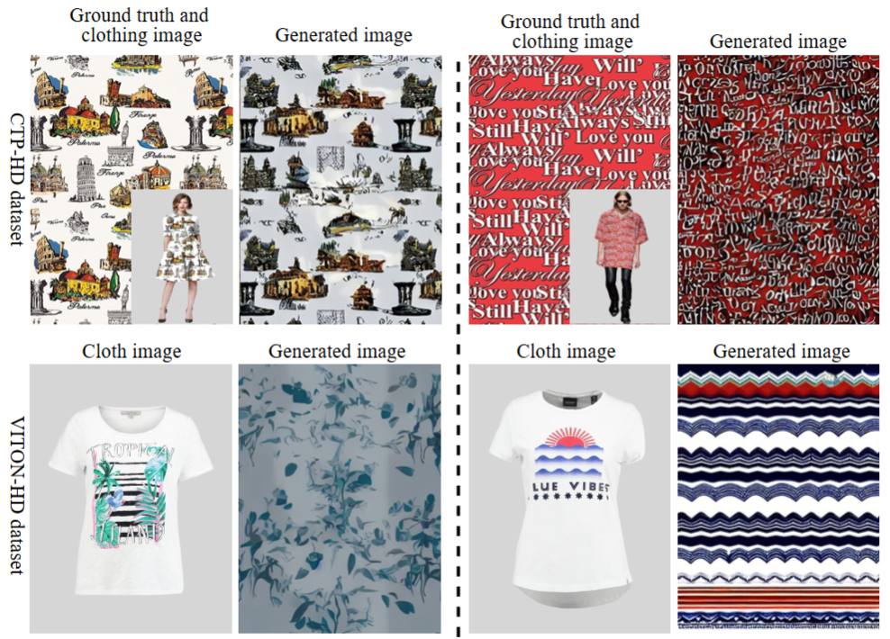 -->
